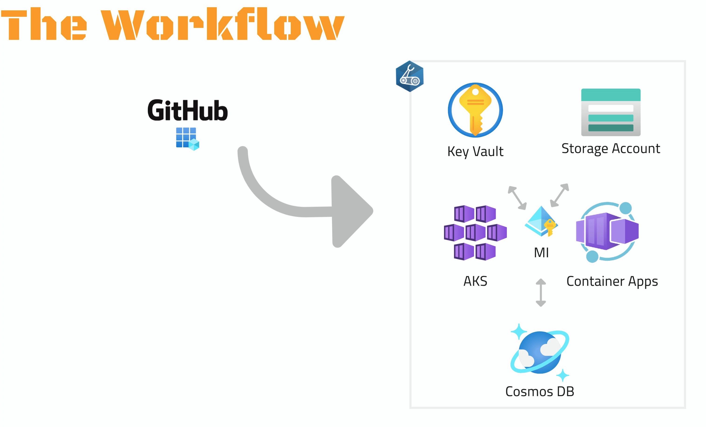

## GOAL 1: Build Scripted and Dynamic Infrastructure
 

#### **A. GRASP THE GOAL:**
Start with the below video:

#### **B. MAKE SURE YOU UNDERSTAND THESE CONCEPTS (STAY FOCUSED ON THE GOAL):**
* [Infrastructure as Code](https://learn.microsoft.com/en-us/devops/deliver/what-is-infrastructure-as-code)
* [Continuous Deployment](https://learn.microsoft.com/en-us/devops/deliver/what-is-continuous-delivery)
* [Azure Resource Groups](https://learn.microsoft.com/en-us/azure/azure-resource-manager/management/manage-resource-groups-portal)
* [Azure AD: Workload Identity Federation](https://learn.microsoft.com/en-us/azure/active-directory/develop/workload-identity-federation)

#### **C. TRY IT YOURSELF (IF POSSIBLE):**
#### 1. Fork this repository
This will allow you to set secret and run your own workflows. Click [here](https://github.com/melzayet/azure-cn-depicted/fork) to fork.

#### 2. Review/Tweak Bicep templates
In this step, we use VS Code to author Bicep templates. We will create an "AKS" and "Container Apps" folder for those templates.
Review those templates and feel free to change their configuration if needed.

#### 3. Review GitHub workflows
Workflows under ".github/workflows" folder will help automate the deployment of infrastructure and apps:

- Deploy AKS infrastructure: aks-cluster-deploy.yml
- Setup AKS cluster: aks-cluster-setup.yml
- Deploy AKS app: aks-app-deploy.yml
- Setup Container Apps infrastructure: aca-infra-deploy.yml
- Deploy Container Apps application: aca-app-deploy.yml

Review these workflows: "aca-infra-deploy.yml" and "aks-cluster-deploy.yml"

#### 4. Setup deployment and app identity
Deployment identity is what GitHub will use to deploy to Azure. Follow the steps [here](https://learn.microsoft.com/en-us/azure/active-directory/develop/workload-identity-federation-create-trust?pivots=identity-wif-apps-methods-azp#github-actions) to create this identity. Please make a note of the Azure AD app's Client ID and the Object ID of the associated Enterprise app.

We will follow the same steps to create an App Identity. It's what AKS will use to access Key Vault, Cosmos DB or Storage Account. Please make a note of the Azure AD app's Client ID, and the Object ID of the associated Enterprise app. No need to create a federated credential for this app yet.

#### 5. Setup deployment target
Create an Azure Resource Group to hold the AKS infrastructure and app resources. It's also a scope for permissions. Make the deployment identity created in step 4, as an Owner for this resource group. Please make a note of the resource group name.

Repeat the same steps for Container Apps if you want to try the service.

#### 6. Set parameters
Set the following GitHub secrets using the steps [here](https://docs.github.com/en/actions/security-guides/encrypted-secrets#creating-encrypted-secrets-for-a-repository):

- AKS_ADMIN_GROUP_ID: ID of an Azure AD Group that can access and administrate the AKS cluster if needed
- AKS_RG: The resource group name for AKS noted in step 5
- APP_IDENTITY_CLIENT_ID: The Client ID for App Identity created in step 4.
- APP_IDENTITY_PRINCIPAL_ID: The Object ID for App Identity's Enterprise App in Azure AD
- DEPLOY_IDENTITY_CLIENT_ID: The Client ID for Deploy Identity created in step 4.
- DEPLOY_IDENTITY_PRINCIPAL_ID: The Object ID for Deploy Identity's Enterprise App in Azure AD
- SUBSCRIPTION_ID: The Subscription ID to deploy infrastructure and where resource group(s) were created
- TENANT_ID: Azure AD Tenant ID
- ACA_RG: The resource group name for Container Apps noted in step 5
- ACA_ENV_NAME: A name for Container Apps environment
- APP_DNS_NAME:  DNS prefix to use for deploying apps later. This needs to be a unique name and DNS friendly

#### 7. Run the first deployment
Either by commiting changes to GitHub or running workflows [directly](https://docs.github.com/en/actions/managing-workflow-runs/manually-running-a-workflow), we can deploy our infrasructure resources

- AKS workflow name: 'Trigger auto deployment for AKS cluster deployment'
- Container Apps workflow name: 'Trigger auto deployment for Azure Container Apps'
