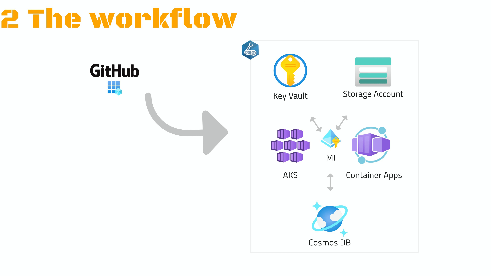

# Depicted: Cloud Native on Azure

Get deeper in Cloud Native, one story at a time. This series will use Azure as the cloud platform

## The Infrastructure

First, get the workflow and core implementation steps depicted in your head:

Then, dive deeper. Inspect files, or follow the guidance to try it yourself:

[01.Infrastructure: The follow-up](01.Platform/README.md)

## Deploying to AKS
## Deploying to Container Apps
## Going private
## Receiving traffic
## Observing
## Scaling
## Keeping state