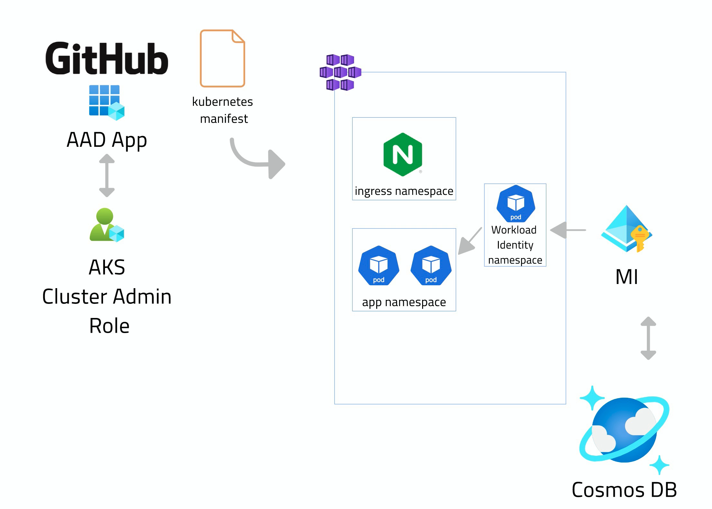

# Depicted: Cloud Native on Azure

Get deeper in Cloud Native, focusing on one goal at a time. This series will use Azure as the cloud platform

 
 

* [GOAL 1: Build Scripted and Dynamic Infrastructure](#goal-1-build-scripted-and-dynamic-infrastructure)
* [GOAL 2: Continuously Deploy to AKS](#goal-2-continuously-deploy-to-aks)
* [GOAL 3: Continuously Deploy to Container Apps](#goal-3-continuously-deploy-to-container-apps)

 
 

Each goal is visually depicted in ~5 min video. This is a sample one:

