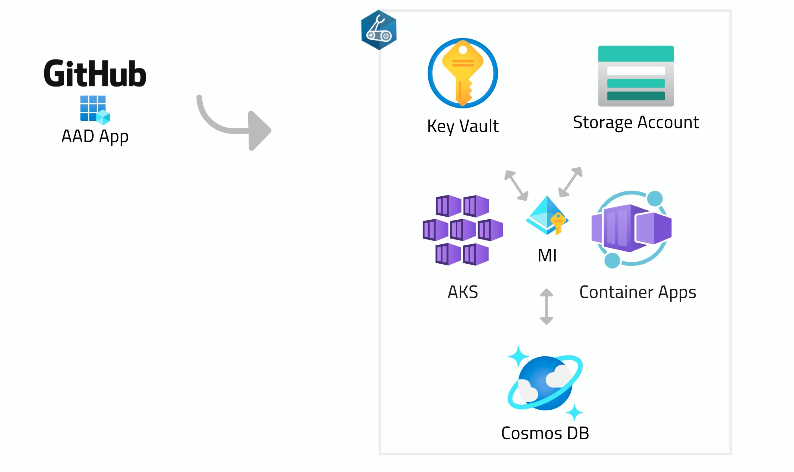

# Depicted: Cloud Native on Azure

Get deeper in Cloud Native, focusing on one goal at a time. This series will use Azure as the cloud platform

 
 

* [GOAL 1: Build Scripted and Dynamic Infrastructure](#goal-1-build-scripted-and-dynamic-infrastructure)
* [GOAL 2: Continuously Deploy to AKS](#goal-2-continuously-deploy-to-aks)
* [GOAL 3: Continuously Deploy to Container Apps](#goal-3-continuously-deploy-to-container-apps)

 
 

## GOAL 1: Build Scripted and Dynamic Infrastructure

#### **A. GRASP THE GOAL:**
Start with the below video:

#### **B. MAKE SURE YOU UNDERSTAND THESE CONCEPTS (STAY FOCUSED ON THE GOAL):**
* [Infrastructure as Code](https://learn.microsoft.com/en-us/devops/deliver/what-is-infrastructure-as-code)
* [Continuous Deployment](https://learn.microsoft.com/en-us/devops/deliver/what-is-continuous-delivery)
* [Azure Resource Groups](https://learn.microsoft.com/en-us/azure/azure-resource-manager/management/manage-resource-groups-portal)
* [Azure AD: Workload Identity Federation](https://learn.microsoft.com/en-us/azure/active-directory/develop/workload-identity-federation)

#### **C. TRY IT YOURSELF (IF POSSIBLE):**
[01.Infrastructure: Implementation](01.DeployInfrastructure/README.md)

## GOAL 2: Continuously Deploy to AKS

#### **A. GRASP THE GOAL:**
Start with the below video:

## GOAL 3: Continuously Deploy to Container Apps
## GOAL 4: Going private
## GOAL 5: Optimizing Ingress
## GOAL 5: Observability 
## GOAL 6: Scalability